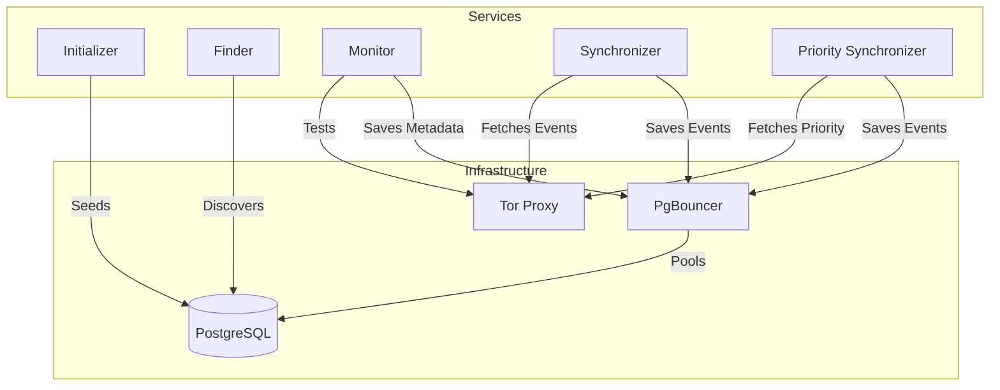
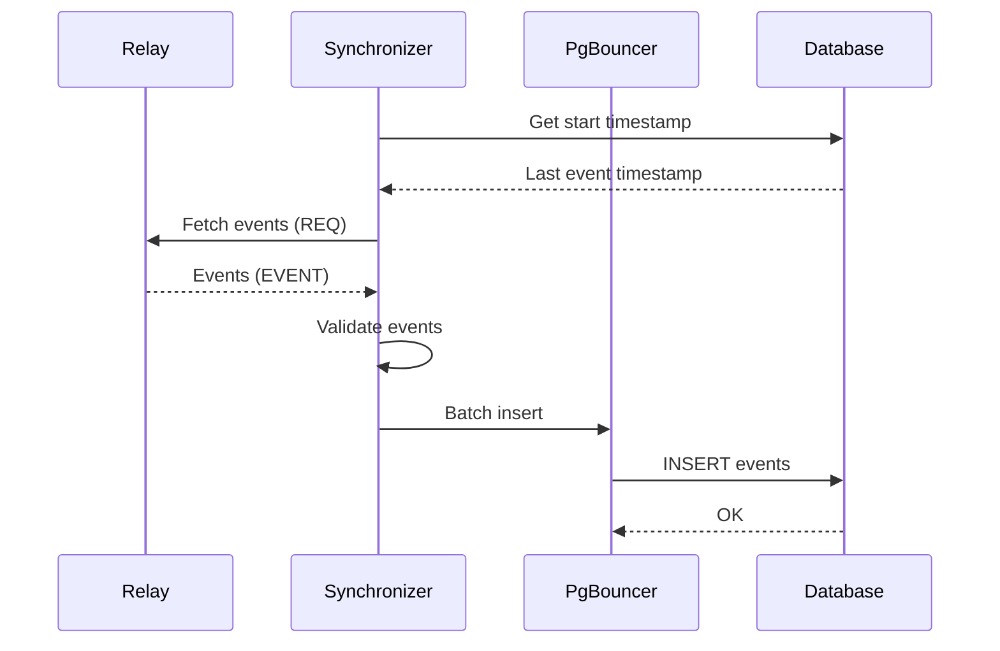

# Bigbrotr Improvements Roadmap

**Status**: Critical issues resolved ✅ | **Remaining**: 89 improvements
**Generated**: 2025-10-29
**Total Estimated Time**: 25-45 days

---

## 🟠 HIGH PRIORITY ISSUES (12 items)

### **#6. Remove Deprecated Sync `get_start_time()` Function**
**Location**: [src/process_relay.py:74-141](src/process_relay.py#L74-141)
**Effort**: 5 minutes
**Impact**: Code cleanup, remove 68 lines of dead code

**Problem**: Old sync database API function that no longer exists

**Fix**:
```python
# Delete lines 74-141 entirely
```

---

### **#7. Remove Hardcoded Logging Configuration**
**Location**: [src/process_relay.py:9-12](src/process_relay.py#L9-12)
**Effort**: 10 minutes
**Impact**: Consistent logging across services

**Problem**: Overrides centralized logging setup

**Fix**:
```python
# Remove these lines:
# logging.basicConfig(
#     level=logging.INFO,
#     format="%(asctime)s - %(levelname)s - %(message)s"
# )

# Add instead:
from logging_config import setup_logging
setup_logging("PROCESS_RELAY")
```

---

### **#8. Document TORPROXY Config for Finder**
**Location**: [src/finder.py](src/finder.py)
**Effort**: 15 minutes
**Impact**: Future implementation clarity

**Problem**: Finder loads torproxy config but doesn't use it yet

**Fix**: Add comment in finder.py:
```python
# TORPROXY configuration loaded for future relay discovery:
# - Discovering relays from .onion NIP-11 documents
# - Fetching kind 10002 events from tor relays
```

---

### **#9. Validate Priority Relays File Exists**
**Location**: [src/config.py:79](src/config.py#L79)
**Effort**: 10 minutes
**Impact**: Better error messages

**Problem**: Doesn't check if `SYNCHRONIZER_PRIORITY_RELAYS_PATH` file exists

**Fix**:
```python
# In load_synchronizer_config(), after line 79:
if not os.path.exists(config["priority_relays_path"]):
    logging.warning(f"⚠️ Priority relays file not found: {config['priority_relays_path']}")
    logging.info("Creating empty priority relays file...")
    with open(config["priority_relays_path"], 'w') as f:
        f.write("# Priority relays (one URL per line)\n")
```

---

### **#10. Fix Event Loop Resource Leak in Monitor Worker**
**Location**: [src/monitor.py:132-138](src/monitor.py#L132-138)
**Effort**: 15 minutes
**Impact**: Prevent resource leaks

**Problem**: Complex event loop detection logic that may not close loops properly

**Fix**:
```python
# Replace lines 123-138 with:
def metadata_monitor_worker(chunk: List[Relay], config: Dict[str, Any], generated_at: int) -> None:
    """Worker function for multiprocessing pool."""
    loop = asyncio.new_event_loop()
    asyncio.set_event_loop(loop)

    try:
        return loop.run_until_complete(worker_async(chunk, config, generated_at))
    finally:
        loop.close()
```

---

### **#11. Add Shutdown Flag Check in Synchronizer Worker**
**Location**: [src/synchronizer.py:110](src/synchronizer.py#L110)
**Effort**: 5 minutes
**Impact**: Proper graceful shutdown

**Problem**: Already fixed! ✅ (shutdown_flag is now checked in line 110)

**Status**: COMPLETE ✅

---

### **#12. Add Relay URL Context to Exception Logging**
**Location**: [src/monitor.py:84](src/monitor.py#L84), [src/synchronizer.py:87](src/synchronizer.py#L87)
**Effort**: 30 minutes
**Impact**: Better debugging

**Problem**: Generic exception logging without clear context

**Fix**:
```python
# Use structured logging with relay context
logging.exception(f"❌ Error processing {relay.url}: {e}", extra={
    "relay_url": relay.url,
    "relay_network": relay.network,
    "operation": "metadata_fetch"  # or "event_sync"
})
```

---

### **#13. Inefficient Query in `fetch_relays_from_database()`**
**Location**: [src/relay_loader.py:47-56](src/relay_loader.py#L47-56)
**Effort**: 20 minutes
**Impact**: Faster relay queries

**Problem**: Correlated subquery runs for every row (O(N²) complexity)

**Fix**:
```python
# Replace query with:
query = """
    SELECT relay_url
    FROM relay_metadata_latest
    WHERE generated_at > $1
"""

if readable_only:
    query += " AND nip66_readable = TRUE"
```

Or use window functions:
```python
query = """
    WITH ranked AS (
        SELECT relay_url,
               ROW_NUMBER() OVER (PARTITION BY relay_url ORDER BY generated_at DESC) as rn
        FROM relay_metadata
        WHERE generated_at > $1
    )
    SELECT relay_url FROM ranked WHERE rn = 1
"""
```

---

### **#14. Inefficient Query in `fetch_relays_needing_metadata()`**
**Location**: [src/relay_loader.py:163-173](src/relay_loader.py#L163-173)
**Effort**: 20 minutes
**Impact**: Faster relay queries

**Problem**: Similar correlated subquery issue

**Fix**:
```python
query = """
    SELECT r.url
    FROM relays r
    LEFT JOIN LATERAL (
        SELECT generated_at
        FROM relay_metadata
        WHERE relay_url = r.url
        ORDER BY generated_at DESC
        LIMIT 1
    ) rm ON TRUE
    WHERE rm.generated_at IS NULL OR rm.generated_at < $1
"""
```

---

### **#15. Hardcoded Connection Timeout**
**Location**: [src/bigbrotr.py:71](src/bigbrotr.py#L71)
**Effort**: 15 minutes
**Impact**: Configurable performance tuning

**Problem**: `command_timeout=60` hardcoded

**Fix**:
```python
# Add to __init__ parameters:
def __init__(
    self,
    host: str,
    port: int,
    user: str,
    password: str,
    dbname: str,
    min_pool_size: int = 5,
    max_pool_size: int = 20,
    command_timeout: int = 60,  # NEW
):
    # ...
    self.command_timeout = command_timeout

# Use in connect():
self.pool = await asyncpg.create_pool(
    # ...
    command_timeout=self.command_timeout,
)

# Add environment variable:
# DATABASE_COMMAND_TIMEOUT=60
```

---

### **#16. No Pool Size Configuration**
**Location**: [src/bigbrotr.py:34-35](src/bigbrotr.py#L34-35)
**Effort**: 20 minutes
**Impact**: Fine-tune per service

**Problem**: Default pool sizes (5-20) not configurable per service

**Fix**:
```python
# Add to env.example:
# SYNCHRONIZER_DB_MIN_POOL=2
# SYNCHRONIZER_DB_MAX_POOL=5
# MONITOR_DB_MIN_POOL=2
# MONITOR_DB_MAX_POOL=5

# Update config.py to load these
# Update services to pass pool sizes to Bigbrotr()
```

---

### **#17. Redundant Relay Shuffling**
**Location**: [src/relay_loader.py:77, 110](src/relay_loader.py)
**Effort**: 5 minutes
**Impact**: Minor performance gain

**Problem**: Shuffling relays unnecessarily

**Fix**:
```python
# Make shuffling optional:
def fetch_relays_from_database(
    config: Dict[str, Any],
    threshold_hours: int = 12,
    readable_only: bool = True,
    shuffle: bool = False  # NEW parameter
) -> List[Relay]:
    # ... existing code ...

    if shuffle:
        random.shuffle(relays)
    return relays
```

---

### **#18. Missing Metrics/Observability**
**Location**: All services
**Effort**: 2-3 days
**Impact**: Production monitoring

**Problem**: No metrics collection (Prometheus, StatsD, etc.)

**Fix**: Add prometheus_client to requirements.txt:
```python
from prometheus_client import Counter, Histogram, Gauge, start_http_server

# In each service:
events_processed = Counter('bigbrotr_events_processed_total', 'Events processed', ['service'])
relays_monitored = Counter('bigbrotr_relays_monitored_total', 'Relays monitored')
db_pool_size = Gauge('bigbrotr_db_pool_connections', 'DB pool connections', ['state'])
processing_duration = Histogram('bigbrotr_processing_seconds', 'Processing duration')

# Start metrics server (separate port):
start_http_server(9090)  # Metrics on :9090/metrics
```

Add to docker-compose.yml:
```yaml
prometheus:
  image: prom/prometheus
  volumes:
    - ./prometheus.yml:/etc/prometheus/prometheus.yml
  ports:
    - "9090:9090"

grafana:
  image: grafana/grafana
  ports:
    - "3000:3000"
  depends_on:
    - prometheus
```

---

### **#19. No Rate Limiting on Relay Connections**
**Location**: [src/monitor.py](src/monitor.py), [src/synchronizer.py](src/synchronizer.py)
**Effort**: 4-6 hours
**Impact**: Be a good network citizen

**Problem**: Can overwhelm relays with concurrent requests

**Fix**:
```python
# Add aiolimiter to requirements.txt
from aiolimiter import AsyncLimiter

# Per-relay rate limiter (use NIP-11 limitation hints)
rate_limiter = AsyncLimiter(max_rate=10, time_period=1)  # 10 req/sec

async def process_relay(bigbrotr, client, event_filter):
    async with rate_limiter:
        # Existing processing logic
        pass
```

---

### **#20. No Retry Logic for Transient Failures**
**Location**: [src/process_relay.py:154-159](src/process_relay.py#L154-159)
**Effort**: 2-3 hours
**Impact**: Better reliability

**Problem**: Invalid events and network errors both just skip

**Fix**:
```python
from tenacity import retry, stop_after_attempt, wait_exponential

@retry(
    stop=stop_after_attempt(3),
    wait=wait_exponential(multiplier=1, min=2, max=10),
    reraise=True
)
async def insert_batch_with_retry(bigbrotr, batch, relay, seen_at):
    """Insert batch with retry on transient errors."""
    return await insert_batch(bigbrotr, batch, relay, seen_at)

# Distinguish validation errors from network errors
try:
    event = Event.from_dict(event_data)
except ValidationError as e:
    # Skip invalid events (don't retry)
    logging.warning(f"Invalid event: {e}")
except ConnectionError as e:
    # Retry network errors
    await insert_batch_with_retry(...)
```

---

### **#21. Process Relay Validation Too Strict**
**Location**: [src/process_relay.py:225-228](src/process_relay.py#L225-228)
**Effort**: 10 minutes
**Impact**: Better performance

**Problem**: Forces disconnect-reconnect cycle

**Fix**:
```python
# Remove these checks (lines 225-228):
# if bigbrotr.is_connected:
#     raise ValueError("bigbrotr must be disconnected before calling process_relay")
# if client.is_connected:
#     raise ValueError("client must be disconnected before calling process_relay")

# Context managers handle connection state automatically
```

---

### **#22. No Pagination Safety in Binary Search**
**Location**: [src/process_relay.py:236-289](src/process_relay.py#L236-289)
**Effort**: 30 minutes
**Impact**: Prevent infinite loops

**Problem**: Infinite loop possible if relay behaves inconsistently

**Fix**:
```python
async def process_relay(bigbrotr: Bigbrotr, client: Client, filter: Filter) -> None:
    """Process relay events and insert them into the database."""
    # ... existing validation ...

    max_depth = 100  # Maximum recursion depth
    depth_counter = 0

    async with bigbrotr:
        async with client:
            until_stack = [filter.until]
            while until_stack and depth_counter < max_depth:
                depth_counter += 1

                # ... existing logic ...

            if depth_counter >= max_depth:
                logging.warning(
                    f"⚠️ Max recursion depth reached for {client.relay.url}. "
                    f"Possible relay pagination issue."
                )
```

---

### **#23. Unhandled Edge Case: Zero-Limit Relays**
**Location**: [src/process_relay.py](src/process_relay.py)
**Effort**: 1 hour
**Impact**: Handle edge cases

**Problem**: Relays with limit < 10 may not converge

**Fix**:
```python
async def process_relay(bigbrotr: Bigbrotr, client: Client, filter: Filter) -> None:
    """Process relay events and insert them into the database."""
    # ... existing checks ...

    if filter.limit is None:
        raise ValueError("filter must have limit")

    if filter.limit < 10:
        logging.warning(
            f"⚠️ Relay {client.relay.url} has very small limit ({filter.limit}). "
            f"Using sequential fetch mode."
        )
        # Use simple sequential fetching instead of binary search
        await process_relay_sequential(bigbrotr, client, filter)
        return

    # ... existing binary search logic ...
```

---

## 🟡 MEDIUM PRIORITY IMPROVEMENTS (18 items)

### **#24. Missing Index on `events.created_at, events.kind`**
**Location**: [init.sql:289-290](init.sql#L289-290)
**Effort**: 5 minutes
**Impact**: Faster queries

**Fix**:
```sql
-- Add to init.sql after line 290:
CREATE INDEX IF NOT EXISTS idx_events_created_at_kind
ON events(created_at DESC, kind);
```

---

### **#25. No VACUUM/ANALYZE Schedule**
**Location**: PostgreSQL configuration
**Effort**: 30 minutes
**Impact**: Better query performance

**Fix**: Update `zima_postgresql.conf`:
```conf
# Aggressive autovacuum for high-write workload
autovacuum = on
autovacuum_vacuum_scale_factor = 0.05  # Vacuum when 5% of table changes
autovacuum_analyze_scale_factor = 0.02  # Analyze when 2% changes
autovacuum_vacuum_cost_delay = 10ms
autovacuum_vacuum_cost_limit = 1000
autovacuum_naptime = 10s  # Check every 10 seconds

# Increase workers for parallel vacuuming
autovacuum_max_workers = 4
```

---

### **#26. No Partitioning for `events` Table**
**Location**: [init.sql:140-149](init.sql#L140-149)
**Effort**: 3-4 hours
**Impact**: Scalability for billions of events

**Fix**:
```sql
-- Replace events table with partitioned version:
CREATE TABLE IF NOT EXISTS events (
    id          CHAR(64)    NOT NULL,
    pubkey      CHAR(64)    NOT NULL,
    created_at  BIGINT      NOT NULL,
    kind        INTEGER     NOT NULL,
    tags        JSONB       NOT NULL,
    tagvalues   TEXT[]      GENERATED ALWAYS AS (tags_to_tagvalues(tags)) STORED,
    content     TEXT        NOT NULL,
    sig         CHAR(128)   NOT NULL,
    PRIMARY KEY (id, created_at)
) PARTITION BY RANGE (created_at);

-- Create monthly partitions
CREATE TABLE events_2024_01 PARTITION OF events
    FOR VALUES FROM (1704067200) TO (1706745600);  -- Jan 2024

CREATE TABLE events_2024_02 PARTITION OF events
    FOR VALUES FROM (1706745600) TO (1709251200);  -- Feb 2024

-- Add script to auto-create future partitions
```

---

### **#27. No Composite Index for Relay Metadata Queries**
**Location**: [init.sql](init.sql)
**Effort**: 10 minutes
**Impact**: Faster relay metadata lookups

**Fix**:
```sql
-- Add to init.sql after line 329:
CREATE INDEX IF NOT EXISTS idx_relay_metadata_latest_readable
ON relay_metadata(relay_url, generated_at DESC, nip66_id)
WHERE nip66_id IS NOT NULL;

-- Covering index for synchronizer queries
CREATE INDEX IF NOT EXISTS idx_relay_metadata_covering
ON relay_metadata(generated_at DESC, relay_url)
INCLUDE (nip66_id, nip11_id);
```

---

### **#28. Overly Broad Exception Handling**
**Location**: Multiple files
**Effort**: 2-3 hours
**Impact**: Better error tracking

**Fix**:
```python
# Replace generic exception handlers:
# ❌ Bad:
except Exception as e:
    logging.exception(f"Error: {e}")

# ✅ Good:
except (ValueError, TypeError) as e:
    logging.error(f"Validation error: {e}")
except (ConnectionError, TimeoutError, asyncio.TimeoutError) as e:
    logging.warning(f"Network error: {e}")
except Exception as e:
    logging.exception(f"Unexpected error: {e}")
    raise  # Re-raise unexpected errors
```

---

### **#29. No Circuit Breaker for Failing Relays**
**Location**: [src/monitor.py](src/monitor.py), [src/synchronizer.py](src/synchronizer.py)
**Effort**: 4-6 hours
**Impact**: Avoid wasting resources on dead relays

**Fix**:
```python
from circuitbreaker import circuit

# Create circuit breaker for each relay
@circuit(failure_threshold=5, recovery_timeout=300, expected_exception=Exception)
async def process_relay_with_circuit_breaker(bigbrotr, client, event_filter):
    return await process_relay(bigbrotr, client, event_filter)

# Track relay health in database:
CREATE TABLE relay_health (
    relay_url TEXT PRIMARY KEY,
    failure_count INTEGER DEFAULT 0,
    last_success_at BIGINT,
    last_failure_at BIGINT,
    circuit_state TEXT  -- 'closed', 'open', 'half_open'
);
```

---

### **#30. Missing Relay Blacklist/Whitelist**
**Location**: Configuration
**Effort**: 2-3 hours
**Impact**: Control over relay processing

**Fix**:
```python
# Add to env.example:
RELAY_BLACKLIST_PATH=./relay_blacklist.txt  # Permanently exclude
RELAY_WHITELIST_PATH=./relay_whitelist.txt  # Only process these (if set)

# In relay_loader.py:
async def fetch_relays_from_database(config, threshold_hours=12, readable_only=True):
    # ... existing code ...

    # Load blacklist
    if config.get("relay_blacklist_path"):
        with open(config["relay_blacklist_path"]) as f:
            blacklist = {line.strip() for line in f if line.strip() and not line.startswith("#")}
        relays = [r for r in relays if r.url not in blacklist]

    # Load whitelist (if set, only process these)
    if config.get("relay_whitelist_path"):
        with open(config["relay_whitelist_path"]) as f:
            whitelist = {line.strip() for line in f if line.strip() and not line.startswith("#")}
        relays = [r for r in relays if r.url in whitelist]

    return relays
```

---

### **#31-39. Code Quality Improvements**
See separate section below.

---

## 🔵 CODE QUALITY IMPROVEMENTS (10 items)

### **#31. Type Hints Incomplete**
**Effort**: 3-4 hours
**Impact**: Better IDE support, catch type errors

**Fix**: Add type hints to all functions:
```python
# ❌ Before:
async def process_relay(config, relay, generated_at):

# ✅ After:
async def process_relay(
    config: Dict[str, Any],
    relay: Relay,
    generated_at: int
) -> RelayMetadata:
```

Run mypy for type checking:
```bash
pip install mypy
mypy src/
```

---

### **#32. Magic Numbers in Code**
**Effort**: 1-2 hours
**Impact**: Better maintainability

**Fix**:
```python
# Add to constants.py:
QUEUE_GET_TIMEOUT = 1  # seconds
MAX_RECURSION_DEPTH = 100
RELAY_MIN_LIMIT = 10

# Use in code:
relay = shared_queue.get(timeout=QUEUE_GET_TIMEOUT)
```

---

### **#33. Inconsistent Error Message Formatting**
**Effort**: 2-3 hours
**Impact**: Better log parsing

**Fix**:
```python
# Standardize logging format:
# ✅ Success: Use ✅ prefix
logging.info("✅ Completed processing relay {relay.url}")

# ⚠️ Warning: Use ⚠️ prefix
logging.warning(f"⚠️ Timeout processing {relay.url}")

# ❌ Error: Use ❌ prefix
logging.error(f"❌ Failed to connect to {relay.url}")

# 🔄 Progress: Use 🔄 prefix
logging.info(f"🔄 Processing {len(relays)} relays...")
```

---

### **#34. Duplicate Code in Synchronizers**
**Effort**: 3-4 hours
**Impact**: DRY principle, easier maintenance

**Problem**: 95% code duplication between synchronizer.py and priority_synchronizer.py

**Fix**:
```python
# Create src/synchronizer_common.py:
def create_relay_worker_thread(config, shared_queue, end_time, service_name="synchronizer"):
    """Shared worker thread implementation."""
    # Move common logic here
    pass

def create_relay_processor_worker(config, shared_queue, end_time, num_threads):
    """Shared processor worker implementation."""
    pass

# In synchronizer.py:
from synchronizer_common import create_relay_worker_thread, create_relay_processor_worker

relay_worker_thread = lambda cfg, q, t: create_relay_worker_thread(cfg, q, t, "synchronizer")
relay_processor_worker = create_relay_processor_worker

# In priority_synchronizer.py:
priority_relay_worker_thread = lambda cfg, q, t: create_relay_worker_thread(cfg, q, t, "priority_synchronizer")
priority_relay_processor_worker = create_relay_processor_worker
```

---

### **#35. No Docstring for RawEventBatch**
**Effort**: 15 minutes
**Impact**: Better code documentation

**Fix**:
```python
class RawEventBatch:
    """Batch container for raw Nostr events with time boundaries.

    Tracks a batch of events fetched from a relay within a specific time interval.
    Used by the binary search algorithm to detect pagination limits and gaps.

    Attributes:
        since (int): Start of time interval (inclusive)
        until (int): End of time interval (inclusive)
        limit (int): Maximum number of events in this batch
        size (int): Current number of events in batch
        raw_events (List[Dict]): List of raw event dictionaries
        min_created_at (int): Earliest created_at in batch
        max_created_at (int): Latest created_at in batch

    Example:
        >>> batch = RawEventBatch(since=1000, until=2000, limit=500)
        >>> batch.append({"created_at": 1500, "id": "abc..."})
        >>> batch.is_full()
        False
    """
```

---

### **#36. Inconsistent Naming: `bigbrotr` vs `db`**
**Effort**: 2 hours
**Impact**: Code consistency

**Fix**:
```python
# Standardize on 'db' for brevity:
# ❌ Before:
async with Bigbrotr(...) as bigbrotr:
    await bigbrotr.insert_event_batch(...)

# ✅ After:
async with Bigbrotr(...) as db:
    await db.insert_event_batch(...)
```

---

### **#37. Long Parameter Lists**
**Effort**: 4-6 hours
**Impact**: Better API design

**Problem**: `insert_relay_metadata()` has 25 parameters

**Fix**:
```python
# Accept RelayMetadata object directly:
async def insert_relay_metadata(self, relay_metadata: RelayMetadata) -> None:
    """Insert relay metadata into the database.

    This method already accepts RelayMetadata object! ✅
    No changes needed.
    """
    # Current implementation is actually already good!
```

**Status**: Already optimal ✅

---

### **#38. No Logging Level Configuration**
**Effort**: 30 minutes
**Impact**: Production log control

**Fix**:
```python
# Add to env.example:
LOG_LEVEL=INFO  # DEBUG, INFO, WARNING, ERROR

# In logging_config.py:
def setup_logging(service_name: str, level: Optional[str] = None) -> None:
    """Setup logging configuration."""
    if level is None:
        level = os.getenv("LOG_LEVEL", "INFO")

    logging.basicConfig(
        level=getattr(logging, level.upper()),
        format=f"%(asctime)s - {service_name} - %(levelname)s - %(message)s"
    )
```

---

### **#39. Missing `__all__` Exports**
**Effort**: 1 hour
**Impact**: Clear public API

**Fix**:
```python
# Add to each module:

# bigbrotr.py:
__all__ = ["Bigbrotr"]

# relay_loader.py:
__all__ = [
    "fetch_relays_from_database",
    "fetch_relays_from_file",
    "fetch_all_relays_from_database",
    "fetch_relays_needing_metadata"
]

# functions.py:
__all__ = [
    "chunkify",
    "test_database_connection_async",
    "test_torproxy_connection",
    "wait_for_services"
]
```

---

### **#40. No Unit Tests**
**Effort**: 1-2 weeks
**Impact**: Code reliability, CI/CD

**Fix**: Create `tests/` directory:
```bash
mkdir -p tests
touch tests/__init__.py
touch tests/test_bigbrotr.py
touch tests/test_relay_loader.py
touch tests/test_process_relay.py
```

```python
# tests/test_bigbrotr.py
import pytest
from bigbrotr import Bigbrotr
from nostr_tools import Event, Relay

@pytest.mark.asyncio
async def test_bigbrotr_connect():
    db = Bigbrotr("localhost", 5432, "test", "test", "test_db")
    async with db:
        assert db.is_connected
    assert not db.is_connected

@pytest.mark.asyncio
async def test_insert_event():
    # Test event insertion
    pass

# Run tests:
# pip install pytest pytest-asyncio
# pytest tests/ -v
```

Add to CI/CD:
```yaml
# .github/workflows/test.yml
name: Tests
on: [push, pull_request]
jobs:
  test:
    runs-on: ubuntu-latest
    steps:
      - uses: actions/checkout@v2
      - uses: actions/setup-python@v2
        with:
          python-version: '3.11'
      - run: pip install -r requirements.txt
      - run: pip install pytest pytest-asyncio
      - run: pytest tests/ -v
```

---

## 🟢 PERFORMANCE OPTIMIZATIONS (10 items)

### **#41. Batch Size Not Tuned Per Relay**
**Effort**: 2-3 hours
**Impact**: Optimal event fetching

**Fix**:
```python
# In process_relay.py, before processing:
async def get_optimal_batch_size(client: Client, default: int = 500) -> int:
    """Determine optimal batch size from relay's NIP-11 limitation."""
    try:
        metadata = await fetch_relay_metadata(client)
        if metadata.nip11 and metadata.nip11.limitation:
            max_limit = metadata.nip11.limitation.get("max_limit")
            if max_limit and max_limit > 0:
                # Use 80% of max_limit to be conservative
                return min(int(max_limit * 0.8), 5000)
    except Exception:
        pass
    return default

# Use in synchronizer:
optimal_limit = await get_optimal_batch_size(client, config["batch_size"])
filter_dict["limit"] = optimal_limit
```

---

### **#42. No Connection Pooling for HTTP Requests**
**Effort**: 1-2 hours
**Impact**: Faster HTTP requests

**Fix**:
```python
# In functions.py, create module-level session:
_http_session: Optional[ClientSession] = None

async def get_http_session() -> ClientSession:
    """Get or create shared HTTP session."""
    global _http_session
    if _http_session is None or _http_session.closed:
        _http_session = ClientSession()
    return _http_session

async def test_torproxy_connection(host, port, timeout=10, logging=None):
    """Test Tor proxy connection with HTTP and WebSocket."""
    session = await get_http_session()
    connector = ProxyConnector.from_url(f"socks5://{host}:{port}")

    # Reuse session with new connector
    async with ClientSession(connector=connector) as proxy_session:
        # ... existing logic ...
```

---

### **#43. Synchronous File I/O in Initializer**
**Effort**: 15 minutes
**Impact**: Faster startup

**Fix**:
```python
# In initializer.py, replace line 22:
# ❌ Before:
with open(config["seed_relays_path"], 'r', encoding='utf-8') as f:
    lines = f.read().splitlines()

# ✅ After:
import aiofiles
async with aiofiles.open(config["seed_relays_path"], 'r', encoding='utf-8') as f:
    content = await f.read()
    lines = content.splitlines()
```

---

### **#44. No Prepared Statements**
**Effort**: 3-4 hours
**Impact**: Faster query execution

**Fix**:
```python
# In bigbrotr.py, add prepared statement caching:
class Bigbrotr:
    def __init__(self, ...):
        # ... existing code ...
        self._prepared_statements: Dict[str, str] = {}

    async def execute(self, query: str, *args: Any) -> str:
        """Execute a query with prepared statement caching."""
        if self.pool is None:
            raise RuntimeError("Connection pool not initialized.")

        async with self.pool.acquire() as conn:
            # asyncpg automatically caches prepared statements per connection
            return await conn.execute(query, *args)

    # No changes needed - asyncpg already does this! ✅
```

**Status**: Already optimized by asyncpg ✅

---

### **#45. No Read Replicas**
**Effort**: 2-3 days
**Impact**: Scale read operations

**Fix**: Add read replica to docker-compose:
```yaml
database_replica:
  image: postgres:15-alpine
  container_name: bigbrotr_database_replica
  environment:
    - POSTGRES_USER=${POSTGRES_USER}
    - POSTGRES_PASSWORD=${POSTGRES_PASSWORD}
    - POSTGRES_DB=${POSTGRES_DB}
  volumes:
    - ./replica_data:/var/lib/postgresql/data
  command: |
    postgres -c 'wal_level=replica'
             -c 'hot_standby=on'
             -c 'max_wal_senders=3'
  networks:
    - network
```

Configure streaming replication:
```bash
# On primary:
CREATE ROLE replicator WITH REPLICATION LOGIN PASSWORD 'repl_password';

# On replica:
# Create recovery.conf for streaming replication
```

Update relay_loader to use replica for reads:
```python
# Route read-only queries to replica:
config["database_host_read"] = "database_replica"
```

---

### **#46. No Caching for Relay Metadata**
**Effort**: 1-2 days
**Impact**: Reduce database load

**Fix**: Add Redis:
```yaml
# docker-compose.yml
redis:
  image: redis:7-alpine
  container_name: bigbrotr_redis
  ports:
    - "6379:6379"
  networks:
    - network
```

```python
# Install: pip install redis aioredis
import aioredis

# In relay_loader.py:
redis_client = await aioredis.create_redis_pool('redis://redis:6379')

async def fetch_relays_from_database(config, threshold_hours=12, readable_only=True):
    cache_key = f"relays:{threshold_hours}:{readable_only}"

    # Try cache first
    cached = await redis_client.get(cache_key)
    if cached:
        relay_urls = json.loads(cached)
        return [Relay(url) for url in relay_urls]

    # Fetch from database
    relays = # ... existing logic ...

    # Cache for threshold_hours
    await redis_client.setex(
        cache_key,
        threshold_hours * 3600,
        json.dumps([r.url for r in relays])
    )

    return relays
```

---

### **#47. Inefficient JSON Serialization**
**Effort**: 1 hour
**Impact**: 2-3x faster JSON ops

**Fix**:
```bash
pip install orjson
```

```python
# In bigbrotr.py:
import orjson

# Replace json.dumps() with orjson.dumps():
# ❌ Before:
json.dumps(event.tags)

# ✅ After:
orjson.dumps(event.tags).decode('utf-8')

# Benchmark shows 2-3x speedup for large JSONB fields
```

---

### **#48. No Bulk Copy for Large Inserts**
**Effort**: 4-6 hours
**Impact**: Much faster bulk inserts

**Fix**:
```python
# In bigbrotr.py:
async def insert_event_batch_copy(self, events: List[Event], relay: Relay, seen_at: int):
    """Insert events using COPY (faster for >1000 events)."""
    if len(events) < 1000:
        # Use regular executemany for small batches
        return await self.insert_event_batch(events, relay, seen_at)

    async with self.pool.acquire() as conn:
        # Prepare data for COPY
        event_records = [
            (e.id, e.pubkey, e.created_at, e.kind,
             orjson.dumps(e.tags).decode('utf-8'), e.content, e.sig)
            for e in events
        ]

        # Use COPY for bulk insert
        await conn.copy_records_to_table(
            'events',
            records=event_records,
            columns=['id', 'pubkey', 'created_at', 'kind', 'tags', 'content', 'sig']
        )

        # Insert relay associations
        # ...
```

---

### **#49. No Index-Only Scans**
**Effort**: 1 hour
**Impact**: Faster queries

**Fix**:
```sql
-- Add covering indexes:
CREATE INDEX idx_relay_metadata_covering
ON relay_metadata(generated_at DESC, relay_url)
INCLUDE (nip66_id, nip11_id);

CREATE INDEX idx_events_relays_covering
ON events_relays(relay_url, seen_at DESC)
INCLUDE (event_id);

-- Queries will use index-only scans (no table access needed)
```

---

### **#50. Queue Size Not Limited**
**Effort**: 30 minutes
**Impact**: Memory control

**Fix**:
```python
# In synchronizer.py and priority_synchronizer.py:
# ❌ Before:
shared_queue: Queue = Queue()

# ✅ After:
from constants import MAX_QUEUE_SIZE
MAX_QUEUE_SIZE = 1000  # Add to constants.py

shared_queue: Queue = Queue(maxsize=MAX_QUEUE_SIZE)

# Handle backpressure:
for relay in relays:
    try:
        shared_queue.put(relay, timeout=5)
    except Full:
        logging.warning("Queue full, waiting for workers...")
        time.sleep(1)
```

---

## 🟣 SECURITY IMPROVEMENTS (10 items)

### **#51. Database Credentials in Environment Variables**
**Effort**: 2-3 hours
**Impact**: Production security

**Fix**: Use Docker secrets:
```yaml
# docker-compose.yml
services:
  database:
    secrets:
      - postgres_password
    environment:
      - POSTGRES_PASSWORD_FILE=/run/secrets/postgres_password

secrets:
  postgres_password:
    file: ./secrets/postgres_password.txt
```

```bash
# Create secrets directory
mkdir -p secrets
echo "your_secure_password" > secrets/postgres_password.txt
chmod 600 secrets/postgres_password.txt
echo "secrets/" >> .gitignore
```

Or use HashiCorp Vault:
```python
import hvac

client = hvac.Client(url='http://vault:8200')
secret = client.secrets.kv.v2.read_secret_version(path='bigbrotr/postgres')
password = secret['data']['data']['password']
```

---

### **#52. No SQL Injection Protection Validation**
**Effort**: 2 hours
**Impact**: Defense in depth

**Fix**:
```python
# Add input validation:
def validate_relay_url(url: str) -> str:
    """Validate relay URL format."""
    if not url.startswith(('ws://', 'wss://')):
        raise ValueError(f"Invalid relay URL scheme: {url}")
    if len(url) > 500:
        raise ValueError(f"Relay URL too long: {len(url)} chars")
    # Basic URL validation
    from urllib.parse import urlparse
    parsed = urlparse(url)
    if not parsed.netloc:
        raise ValueError(f"Invalid relay URL: {url}")
    return url

def validate_event_id(event_id: str) -> str:
    """Validate event ID format."""
    if not isinstance(event_id, str):
        raise TypeError(f"Event ID must be string, not {type(event_id)}")
    if len(event_id) != 64:
        raise ValueError(f"Event ID must be 64 chars, not {len(event_id)}")
    if not all(c in '0123456789abcdef' for c in event_id):
        raise ValueError(f"Event ID must be hex: {event_id}")
    return event_id
```

---

### **#53. PgBouncer Admin Password Weak**
**Effort**: 15 minutes
**Impact**: Access control

**Fix**:
```python
# In config.py, add validation:
def validate_password_strength(password: str, name: str) -> None:
    """Validate password meets minimum requirements."""
    if len(password) < 16:
        raise ValueError(f"{name} must be at least 16 characters")
    if password in ["admin", "password", "123456"]:
        raise ValueError(f"{name} is too weak")
    if not any(c.isupper() for c in password):
        raise ValueError(f"{name} must contain uppercase letter")
    if not any(c.isdigit() for c in password):
        raise ValueError(f"{name} must contain digit")

# In env.example:
# PGBOUNCER_ADMIN_PASSWORD=ChangeMe123!SecurePassword  # Must be 16+ chars
```

---

### **#54. No Rate Limiting on Health Endpoints**
**Effort**: 1 hour
**Impact**: DoS protection

**Fix**:
```python
# pip install aiohttp-ratelimit
from aiohttp_ratelimit import setup as setup_ratelimit

# In healthcheck.py:
class HealthCheckServer:
    def __init__(self, ...):
        self.app = web.Application()

        # Add rate limiting middleware
        setup_ratelimit(
            self.app,
            default_ratelimit=(100, 60)  # 100 requests per 60 seconds
        )

        # Setup routes...
```

---

### **#55. No TLS/SSL for Database Connections**
**Effort**: 2-3 hours
**Impact**: Encrypted database traffic

**Fix**:
```python
# Generate SSL certificates
openssl req -new -x509 -days 365 -nodes -text \
  -out server.crt -keyout server.key -subj "/CN=postgres"

# Update postgresql.conf:
ssl = on
ssl_cert_file = '/var/lib/postgresql/server.crt'
ssl_key_file = '/var/lib/postgresql/server.key'

# In bigbrotr.py:
import ssl

self.pool = await asyncpg.create_pool(
    # ... existing params ...
    ssl=ssl.create_default_context(cafile='/path/to/server.crt')
)

# Or require SSL:
ssl='require'  # Simpler, uses system CA
```

---

### **#56. Secrets Logged on Error**
**Effort**: 1 hour
**Impact**: Prevent credential leaks

**Fix**:
```python
# In config.py:
def redact_secret(secret: str, visible_chars: int = 4) -> str:
    """Redact secret for logging."""
    if len(secret) <= visible_chars:
        return "***"
    return secret[:visible_chars] + "***"

# In error handling:
try:
    if not validate_keypair(config["secret_key"], config["public_key"]):
        logging.error(
            f"❌ Invalid keypair. Public key: {redact_secret(config['public_key'])}"
        )
        sys.exit(1)
except Exception as e:
    logging.error(f"❌ Keypair validation failed: {e}")
    # Never log secret_key!
    sys.exit(1)
```

---

### **#57. No Container User in Dockerfiles**
**Effort**: 30 minutes
**Impact**: Container security

**Fix**: Verify USER directive in all Dockerfiles:
```dockerfile
# In all dockerfiles/*, add:
FROM python:3.11-alpine AS runtime

# Create non-root user
RUN addgroup -g 1000 bigbrotr && \
    adduser -D -u 1000 -G bigbrotr bigbrotr

# Switch to non-root user
USER bigbrotr

# ... rest of dockerfile
```

---

### **#58. No Network Segmentation**
**Effort**: 1-2 hours
**Impact**: Network isolation

**Fix**:
```yaml
# docker-compose.yml
networks:
  frontend:
    driver: bridge
  backend:
    driver: bridge
    internal: true  # No external access

services:
  database:
    networks:
      - backend  # Only backend network

  pgbouncer:
    networks:
      - backend

  synchronizer:
    networks:
      - frontend  # Can access internet
      - backend   # Can access database
```

---

### **#59. PostgreSQL Port Exposed Publicly**
**Effort**: 5 minutes
**Impact**: Reduce attack surface

**Fix**:
```yaml
# docker-compose.yml
database:
  # ❌ Remove this:
  # ports:
  #   - ${DB_PORT}:5432

  # Database only accessible within Docker network
  # Use pgAdmin or docker exec for admin access
```

---

### **#60. No Secrets Scanning in CI/CD**
**Effort**: 1 hour
**Impact**: Prevent secret commits

**Fix**:
```bash
# Install detect-secrets
pip install detect-secrets

# Create baseline
detect-secrets scan > .secrets.baseline

# Add pre-commit hook
# .pre-commit-config.yaml
repos:
  - repo: https://github.com/Yelp/detect-secrets
    rev: v1.4.0
    hooks:
      - id: detect-secrets
        args: ['--baseline', '.secrets.baseline']

# Install hooks
pip install pre-commit
pre-commit install
```

Or use gitleaks:
```yaml
# .github/workflows/secrets.yml
name: Secrets Scan
on: [push, pull_request]
jobs:
  scan:
    runs-on: ubuntu-latest
    steps:
      - uses: actions/checkout@v2
      - uses: gitleaks/gitleaks-action@v2
```

---

## 🟤 OPERATIONAL IMPROVEMENTS (14 items)

### **#61. No Backup Strategy Documented**
**Effort**: 2-3 hours
**Impact**: Disaster recovery

**Fix**: Create backup script:
```bash
#!/bin/bash
# scripts/backup_database.sh

BACKUP_DIR="/backups"
TIMESTAMP=$(date +%Y%m%d_%H%M%S)
DB_NAME="bigbrotr"

# Full backup
docker exec bigbrotr_database pg_dump -U postgres -Fc $DB_NAME > \
  $BACKUP_DIR/bigbrotr_$TIMESTAMP.dump

# Compress
gzip $BACKUP_DIR/bigbrotr_$TIMESTAMP.dump

# Keep only last 7 days
find $BACKUP_DIR -name "bigbrotr_*.dump.gz" -mtime +7 -delete

echo "Backup completed: bigbrotr_$TIMESTAMP.dump.gz"
```

Restore:
```bash
#!/bin/bash
# scripts/restore_database.sh

BACKUP_FILE=$1
docker exec -i bigbrotr_database pg_restore -U postgres -d bigbrotr < $BACKUP_FILE
```

Add cron job:
```cron
# Daily backup at 2 AM
0 2 * * * /path/to/scripts/backup_database.sh
```

Document in OPERATIONS.md

---

### **#62. No Monitoring Dashboards**
**Effort**: 1-2 days
**Impact**: Visibility into system health

**Fix**: Add Grafana dashboard:
```yaml
# docker-compose.yml
grafana:
  image: grafana/grafana:latest
  container_name: bigbrotr_grafana
  ports:
    - "3000:3000"
  environment:
    - GF_SECURITY_ADMIN_PASSWORD=${GRAFANA_PASSWORD}
  volumes:
    - ./grafana/dashboards:/etc/grafana/provisioning/dashboards
    - ./grafana/datasources:/etc/grafana/provisioning/datasources
  networks:
    - network
```

Create dashboard JSON:
```json
{
  "dashboard": {
    "title": "Bigbrotr Monitoring",
    "panels": [
      {
        "title": "Events Processed",
        "targets": [{
          "expr": "rate(bigbrotr_events_processed_total[5m])"
        }]
      },
      {
        "title": "Database Connections",
        "targets": [{
          "expr": "bigbrotr_db_pool_connections"
        }]
      }
    ]
  }
}
```

---

### **#63. No Alerting System**
**Effort**: 1-2 days
**Impact**: Proactive issue detection

**Fix**: Add Prometheus AlertManager:
```yaml
# docker-compose.yml
alertmanager:
  image: prom/alertmanager
  container_name: bigbrotr_alertmanager
  ports:
    - "9093:9093"
  volumes:
    - ./alertmanager.yml:/etc/alertmanager/alertmanager.yml
  networks:
    - network
```

```yaml
# alertmanager.yml
global:
  smtp_smarthost: 'smtp.gmail.com:587'
  smtp_from: 'alerts@bigbrotr.com'
  smtp_auth_username: 'alerts@bigbrotr.com'
  smtp_auth_password: 'password'

route:
  receiver: 'email'

receivers:
  - name: 'email'
    email_configs:
      - to: 'admin@bigbrotr.com'
```

```yaml
# prometheus_alerts.yml
groups:
  - name: bigbrotr
    rules:
      - alert: HighDatabaseConnections
        expr: bigbrotr_db_pool_connections > 80
        for: 5m
        annotations:
          summary: "High database connection usage"

      - alert: ServiceDown
        expr: up{job="bigbrotr"} == 0
        for: 1m
        annotations:
          summary: "Bigbrotr service is down"
```

---

### **#64. No Log Aggregation**
**Effort**: 1-2 days
**Impact**: Centralized logging

**Fix**: Add Loki stack:
```yaml
# docker-compose.yml
loki:
  image: grafana/loki:latest
  ports:
    - "3100:3100"
  volumes:
    - ./loki-config.yml:/etc/loki/local-config.yaml
  networks:
    - network

promtail:
  image: grafana/promtail:latest
  volumes:
    - /var/log:/var/log
    - /var/lib/docker/containers:/var/lib/docker/containers:ro
    - ./promtail-config.yml:/etc/promtail/config.yml
  networks:
    - network
```

Query logs in Grafana:
```logql
{container_name="bigbrotr_synchronizer"} |= "error"
```

---

### **#65. No Tracing/Distributed Tracing**
**Effort**: 2-3 days
**Impact**: Performance debugging

**Fix**: Add OpenTelemetry:
```bash
pip install opentelemetry-api opentelemetry-sdk opentelemetry-instrumentation-asyncpg
```

```python
# In each service:
from opentelemetry import trace
from opentelemetry.sdk.trace import TracerProvider
from opentelemetry.sdk.trace.export import BatchSpanProcessor
from opentelemetry.exporter.jaeger.thrift import JaegerExporter

# Setup tracer
trace.set_tracer_provider(TracerProvider())
jaeger_exporter = JaegerExporter(
    agent_host_name="jaeger",
    agent_port=6831,
)
trace.get_tracer_provider().add_span_processor(
    BatchSpanProcessor(jaeger_exporter)
)

# Instrument code:
tracer = trace.get_tracer(__name__)

with tracer.start_as_current_span("process_relay"):
    await process_relay(bigbrotr, client, event_filter)
```

Add Jaeger to docker-compose:
```yaml
jaeger:
  image: jaegertracing/all-in-one:latest
  ports:
    - "16686:16686"  # UI
    - "6831:6831/udp"  # Agent
  networks:
    - network
```

---

### **#66. No Rolling Updates Strategy**
**Effort**: 1-2 days
**Impact**: Zero-downtime deployments

**Fix**: Migrate to Docker Swarm:
```bash
# Initialize swarm
docker swarm init

# Deploy stack
docker stack deploy -c docker-compose.yml bigbrotr

# Update service (rolling update)
docker service update --image bigbrotr_synchronizer:v2 bigbrotr_synchronizer
```

Or Kubernetes:
```yaml
# k8s/deployment.yml
apiVersion: apps/v1
kind: Deployment
metadata:
  name: synchronizer
spec:
  replicas: 3
  strategy:
    type: RollingUpdate
    rollingUpdate:
      maxSurge: 1
      maxUnavailable: 0
  template:
    spec:
      containers:
      - name: synchronizer
        image: bigbrotr/synchronizer:latest
```

---

### **#67. No Resource Limits**
**Effort**: 1 hour
**Impact**: Resource control

**Fix**:
```yaml
# docker-compose.yml
services:
  synchronizer:
    deploy:
      resources:
        limits:
          cpus: '4.0'
          memory: 8G
        reservations:
          cpus: '2.0'
          memory: 4G

  database:
    deploy:
      resources:
        limits:
          cpus: '8.0'
          memory: 16G
        reservations:
          cpus: '4.0'
          memory: 8G
```

---

### **#68. No Liveness/Readiness Probes in Docker Compose**
**Effort**: 30 minutes
**Impact**: Better orchestration

**Fix**:
```yaml
# docker-compose.yml
services:
  synchronizer:
    healthcheck:
      test: ["CMD", "curl", "-f", "http://localhost:8080/ready"]
      interval: 30s
      timeout: 10s
      retries: 3
      start_period: 40s

  monitor:
    healthcheck:
      test: ["CMD", "curl", "-f", "http://localhost:8080/ready"]
      interval: 30s
      timeout: 10s
      retries: 3
      start_period: 40s
```

---

### **#69. No Database Migration Tool**
**Effort**: 2-3 days
**Impact**: Schema versioning

**Fix**: Add Alembic:
```bash
pip install alembic asyncpg
alembic init migrations
```

```python
# migrations/env.py
from bigbrotr import Bigbrotr
import asyncio

async def run_migrations_online():
    db = Bigbrotr(...)
    async with db.pool.acquire() as conn:
        await conn.execute("ALTER TABLE ...")

asyncio.run(run_migrations_online())
```

```bash
# Create migration
alembic revision -m "add_index_to_events"

# Apply migrations
alembic upgrade head

# Rollback
alembic downgrade -1
```

---

### **#70. No Environment-Specific Configs**
**Effort**: 1-2 hours
**Impact**: Dev/staging/prod separation

**Fix**:
```bash
# Create environment-specific configs
.env.development
.env.staging
.env.production

# Load based on ENV variable
ENV=production docker-compose up
```

```python
# In config.py:
import os

ENV = os.getenv("ENV", "development")

def load_config():
    if ENV == "production":
        # Production settings
        return {
            "log_level": "WARNING",
            "debug": False,
        }
    elif ENV == "staging":
        # Staging settings
        return {
            "log_level": "INFO",
            "debug": False,
        }
    else:
        # Development settings
        return {
            "log_level": "DEBUG",
            "debug": True,
        }
```

---

### **#71. No Data Retention Policy**
**Effort**: 3-4 hours
**Impact**: Manage data growth

**Fix**: Implement partitioning with auto-drop:
```sql
-- Create monthly partitions
CREATE TABLE events_2024_01 PARTITION OF events
    FOR VALUES FROM (1704067200) TO (1706745600);

-- Add function to auto-create future partitions
CREATE OR REPLACE FUNCTION create_monthly_partitions()
RETURNS void AS $$
DECLARE
    start_date TIMESTAMP;
    end_date TIMESTAMP;
    partition_name TEXT;
BEGIN
    -- Create partitions for next 3 months
    FOR i IN 0..2 LOOP
        start_date := date_trunc('month', CURRENT_DATE + (i || ' months')::INTERVAL);
        end_date := start_date + '1 month'::INTERVAL;
        partition_name := 'events_' || to_char(start_date, 'YYYY_MM');

        EXECUTE format('
            CREATE TABLE IF NOT EXISTS %I PARTITION OF events
            FOR VALUES FROM (%L) TO (%L)
        ', partition_name, extract(epoch from start_date), extract(epoch from end_date));
    END LOOP;
END;
$$ LANGUAGE plpgsql;

-- Cron job to create partitions
SELECT cron.schedule('create-partitions', '0 0 1 * *', 'SELECT create_monthly_partitions()');

-- Drop old partitions (>1 year)
CREATE OR REPLACE FUNCTION drop_old_partitions()
RETURNS void AS $$
DECLARE
    partition_name TEXT;
BEGIN
    FOR partition_name IN
        SELECT tablename FROM pg_tables
        WHERE tablename LIKE 'events_%'
        AND tablename < 'events_' || to_char(CURRENT_DATE - '1 year'::INTERVAL, 'YYYY_MM')
    LOOP
        EXECUTE format('DROP TABLE IF EXISTS %I', partition_name);
        RAISE NOTICE 'Dropped partition: %', partition_name;
    END LOOP;
END;
$$ LANGUAGE plpgsql;
```

---

### **#72. No Graceful Shutdown Timeout**
**Effort**: 5 minutes
**Impact**: Clean shutdown

**Fix**:
```yaml
# docker-compose.yml
services:
  synchronizer:
    stop_grace_period: 60s  # Wait up to 60 seconds for graceful shutdown

  monitor:
    stop_grace_period: 60s

  database:
    stop_grace_period: 120s  # More time for database
```

---

### **#73. Service Dependencies Don't Wait for Healthy**
**Effort**: 10 minutes
**Impact**: Proper startup order

**Fix**:
```yaml
# docker-compose.yml (v3.9+)
services:
  database:
    healthcheck:
      test: ["CMD-SHELL", "pg_isready -U postgres"]
      interval: 5s
      timeout: 5s
      retries: 5

  synchronizer:
    depends_on:
      database:
        condition: service_healthy
      pgbouncer:
        condition: service_healthy
```

---

### **#74. No Container Image Scanning**
**Effort**: 1 hour
**Impact**: Security vulnerabilities

**Fix**: Add Trivy to CI/CD:
```yaml
# .github/workflows/scan.yml
name: Container Scan
on: [push]
jobs:
  scan:
    runs-on: ubuntu-latest
    steps:
      - uses: actions/checkout@v2
      - name: Build image
        run: docker build -t bigbrotr/synchronizer:${{ github.sha }} -f dockerfiles/synchronizer .
      - name: Run Trivy scanner
        uses: aquasecurity/trivy-action@master
        with:
          image-ref: bigbrotr/synchronizer:${{ github.sha }}
          format: 'sarif'
          output: 'trivy-results.sarif'
      - name: Upload results
        uses: github/codeql-action/upload-sarif@v2
        with:
          sarif_file: 'trivy-results.sarif'
```

---

### **#75. No Version Pinning for Base Images**
**Effort**: 30 minutes
**Impact**: Reproducible builds

**Fix**:
```dockerfile
# ❌ Before:
FROM postgres:15-alpine

# ✅ After:
FROM postgres:15-alpine@sha256:abc123...

# Or at least pin minor version:
FROM postgres:15.5-alpine

# Get digest:
docker pull postgres:15-alpine
docker inspect postgres:15-alpine | grep Digest
```

Add dependabot:
```yaml
# .github/dependabot.yml
version: 2
updates:
  - package-ecosystem: "docker"
    directory: "/dockerfiles"
    schedule:
      interval: "weekly"
```

---

## 🔶 DOCUMENTATION IMPROVEMENTS (10 items)

### **#76. No API Documentation**
**Effort**: 2-3 hours
**Impact**: Better API understanding

**Fix**: Add OpenAPI spec:
```yaml
# openapi.yml
openapi: 3.0.0
info:
  title: Bigbrotr Health API
  version: 1.0.0

paths:
  /health:
    get:
      summary: Liveness probe
      responses:
        '200':
          description: Service is alive
          content:
            text/plain:
              schema:
                type: string
                example: OK

  /ready:
    get:
      summary: Readiness probe
      responses:
        '200':
          description: Service is ready
        '503':
          description: Service not ready
```

Serve with Swagger UI:
```yaml
swagger-ui:
  image: swaggerapi/swagger-ui
  environment:
    - SWAGGER_JSON=/openapi.yml
  volumes:
    - ./openapi.yml:/openapi.yml
  ports:
    - "8090:8080"
```

---

### **#77. No Architecture Diagrams**
**Effort**: 2-3 hours
**Impact**: Visual understanding

**Fix**: Add Mermaid diagrams to README.md:
````markdown
## Architecture



## Data Flow


````

---

### **#78. No Troubleshooting Guide**
**Effort**: 3-4 hours
**Impact**: Faster issue resolution

**Fix**: Create TROUBLESHOOTING.md:
```markdown
# Troubleshooting Guide

## Common Issues

### Service won't start

**Symptoms**: Container exits immediately

**Check**:
```bash
docker-compose logs -f <service>
```

**Common causes**:
1. Database not ready → Wait for health check
2. Missing environment variable → Check .env
3. Port already in use → Change port in .env

### High database connections

**Symptoms**: "too many connections" error

**Check**:
```sql
SELECT count(*) FROM pg_stat_activity;
```

**Fix**:
```yaml
# Increase PgBouncer pool:
# pgbouncer.ini
max_client_conn = 2000
default_pool_size = 50
```

### Slow event processing

**Check metrics**:
```bash
curl http://localhost:9090/metrics | grep bigbrotr_processing_seconds
```

**Fixes**:
1. Increase NUM_CORES
2. Increase BATCH_SIZE
3. Add more workers
```

---

### **#79. No Performance Tuning Guide**
**Effort**: 3-4 hours
**Impact**: Optimization guidance

**Fix**: Create PERFORMANCE.md:
```markdown
# Performance Tuning Guide

## Configuration for Different Scales

### Small Scale (100 relays, 1M events/day)
```env
SYNCHRONIZER_NUM_CORES=2
SYNCHRONIZER_REQUESTS_PER_CORE=5
SYNCHRONIZER_BATCH_SIZE=500
MONITOR_NUM_CORES=2
```

### Medium Scale (1000 relays, 10M events/day)
```env
SYNCHRONIZER_NUM_CORES=8
SYNCHRONIZER_REQUESTS_PER_CORE=10
SYNCHRONIZER_BATCH_SIZE=1000
MONITOR_NUM_CORES=4
```

### Large Scale (10000 relays, 100M events/day)
```env
SYNCHRONIZER_NUM_CORES=16
SYNCHRONIZER_REQUESTS_PER_CORE=20
SYNCHRONIZER_BATCH_SIZE=5000
MONITOR_NUM_CORES=8
```

## Database Tuning

### PostgreSQL Settings
```conf
shared_buffers = 4GB  # 25% of RAM
effective_cache_size = 12GB  # 75% of RAM
work_mem = 64MB
maintenance_work_mem = 1GB
max_connections = 200
```

## Benchmarking
```bash
# Events per second
watch -n 1 'psql -c "SELECT count(*) FROM events"'

# Database size
psql -c "SELECT pg_size_pretty(pg_database_size('bigbrotr'))"
```
```

---

### **#80. No Development Setup Guide**
**Effort**: 2-3 hours
**Impact**: Contributor onboarding

**Fix**: Create DEVELOPMENT.md:
```markdown
# Development Guide

## Local Development (without Docker)

### Prerequisites
- Python 3.11+
- PostgreSQL 15+
- Tor (optional, for .onion relays)

### Setup
```bash
# Clone repository
git clone https://github.com/yourorg/bigbrotr
cd bigbrotr

# Create virtual environment
python -m venv venv
source venv/bin/activate  # or venv\Scripts\activate on Windows

# Install dependencies
pip install -r requirements.txt

# Setup database
createdb bigbrotr
psql bigbrotr < init.sql

# Configure environment
cp env.example .env
# Edit .env with local settings
```

### Running Services
```bash
# Run synchronizer locally
python src/synchronizer.py

# Run monitor locally
python src/monitor.py
```

### Development Tools
```bash
# Format code
black src/

# Lint
pylint src/

# Type check
mypy src/

# Test
pytest tests/ -v
```

### IDE Setup (VS Code)
```json
{
  "python.linting.enabled": true,
  "python.linting.pylintEnabled": true,
  "python.formatting.provider": "black",
  "python.testing.pytestEnabled": true
}
```
```

---

### **#81. No Contribution Guide**
**Effort**: 1-2 hours
**Impact**: Open source readiness

**Fix**: Create CONTRIBUTING.md:
```markdown
# Contributing to Bigbrotr

## Code Style
- Follow PEP 8
- Use Black for formatting
- Add type hints
- Write docstrings

## Pull Request Process
1. Fork the repository
2. Create feature branch (`git checkout -b feature/amazing-feature`)
3. Commit changes (`git commit -m 'Add amazing feature'`)
4. Push to branch (`git push origin feature/amazing-feature`)
5. Open Pull Request

## Commit Messages
Use conventional commits:
- `feat: add relay discovery`
- `fix: resolve connection leak`
- `docs: update README`
- `refactor: extract common logic`

## Testing
All PRs must include tests:
```bash
pytest tests/ -v --cov=src
```

## Code Review
- All PRs require 1 approval
- CI must pass
- No merge conflicts
```

---

### **#82. No Changelog Automation**
**Effort**: 1 hour
**Impact**: Version tracking

**Fix**: Add conventional-changelog:
```bash
npm install -g conventional-changelog-cli

# Generate changelog
conventional-changelog -p angular -i CHANGELOG.md -s

# Or use release-please (GitHub Action)
```

```yaml
# .github/workflows/release.yml
name: Release
on:
  push:
    branches: [main]
jobs:
  release:
    runs-on: ubuntu-latest
    steps:
      - uses: google-github-actions/release-please-action@v3
        with:
          release-type: python
          package-name: bigbrotr
```

---

### **#83. No Runbook for Operations**
**Effort**: 4-6 hours
**Impact**: Operational procedures

**Fix**: Create RUNBOOK.md:
```markdown
# Operations Runbook

## Daily Tasks
- [ ] Check service health: `curl localhost:8081-8084/health`
- [ ] Review logs for errors: `docker-compose logs --tail=100`
- [ ] Check database size: `psql -c "SELECT pg_size_pretty(pg_database_size('bigbrotr'))"`

## Weekly Tasks
- [ ] Review metrics dashboard
- [ ] Check backup completion
- [ ] Review relay health stats
- [ ] Update blacklist if needed

## Incident Response

### Service Down
1. Check logs: `docker-compose logs -f <service>`
2. Check dependencies: `docker ps`
3. Restart service: `docker-compose restart <service>`
4. Check health: `curl localhost:808X/health`

### Database Full
1. Check size: `SELECT pg_size_pretty(pg_total_relation_size('events'))`
2. Vacuum: `VACUUM FULL ANALYZE events`
3. Drop old partitions
4. Increase disk space

### High Memory Usage
1. Check stats: `docker stats`
2. Reduce NUM_CORES
3. Reduce BATCH_SIZE
4. Add swap space

## Backup/Restore

### Backup
```bash
./scripts/backup_database.sh
```

### Restore
```bash
./scripts/restore_database.sh /path/to/backup.dump.gz
```

## Scaling

### Horizontal Scaling
```bash
docker-compose up --scale synchronizer=3
```

### Vertical Scaling
```yaml
# Increase resources in docker-compose.yml
deploy:
  resources:
    limits:
      cpus: '8.0'
      memory: 16G
```
```

---

### **#84. No Database Schema Visualization**
**Effort**: 1 hour
**Impact**: Schema understanding

**Fix**: Generate ERD:
```bash
# Use SchemaSpy
docker run -v "$PWD:/output" schemaspy/schemaspy:latest \
  -t pgsql \
  -host database \
  -db bigbrotr \
  -u postgres \
  -p password \
  -o /output/schema

# Or dbdiagram.io - create schema.dbml:
```

```dbml
Table relays {
  url text [pk]
  network text
  inserted_at bigint
}

Table events {
  id char(64) [pk]
  pubkey char(64)
  created_at bigint
  kind integer
  tags jsonb
  content text
  sig char(128)
}

Table events_relays {
  event_id char(64) [ref: > events.id]
  relay_url text [ref: > relays.url]
  seen_at bigint
}

Table relay_metadata {
  relay_url text [ref: > relays.url]
  generated_at bigint
  nip11_id char(64) [ref: > nip11.id]
  nip66_id char(64) [ref: > nip66.id]
}
```

---

### **#85. Missing NIP References**
**Effort**: 30 minutes
**Impact**: Protocol understanding

**Fix**: Update README.md:
```markdown
## Nostr Protocol Support

This project implements the following NIPs:

- [NIP-01](https://github.com/nostr-protocol/nips/blob/master/01.md): Basic protocol flow
- [NIP-11](https://github.com/nostr-protocol/nips/blob/master/11.md): Relay information document
- [NIP-66](https://github.com/nostr-protocol/nips/blob/master/66.md): Relay monitoring

For more information about the Nostr protocol:
- [Nostr NIPs Repository](https://github.com/nostr-protocol/nips)
- [Nostr Tools (Python)](https://github.com/jeffthibault/python-nostr-tools)
```

---

## 🔷 CONFIGURATION IMPROVEMENTS (5 items)

### **#86. No Config Validation on Startup**
**Effort**: 2-3 hours
**Impact**: Fail-fast on misconfig

**Fix**: Add comprehensive validation:
```python
# In config.py:
def validate_all_config(config: Dict[str, Any]) -> None:
    """Validate all configuration values."""
    errors = []

    # Required fields
    required = ["database_host", "database_port", "database_user", "database_password"]
    for field in required:
        if field not in config:
            errors.append(f"Missing required field: {field}")

    # Port ranges
    for port_field in ["database_port", "torproxy_port"]:
        if port_field in config:
            if not (0 <= config[port_field] <= 65535):
                errors.append(f"{port_field} must be 0-65535, got {config[port_field]}")

    # Positive integers
    for int_field in ["num_cores", "batch_size", "timeout"]:
        if int_field in config:
            if config[int_field] < 1:
                errors.append(f"{int_field} must be positive, got {config[int_field]}")

    # File existence
    for file_field in ["priority_relays_path", "seed_relays_path"]:
        if file_field in config:
            if not os.path.exists(config[file_field]):
                errors.append(f"File not found: {config[file_field]}")

    if errors:
        for error in errors:
            logging.error(f"❌ Configuration error: {error}")
        sys.exit(1)

    logging.info("✅ Configuration validated successfully")

# In each service:
config = load_monitor_config()
validate_all_config(config)
```

---

### **#87. No Default Values Documentation**
**Effort**: 1 hour
**Impact**: Clear documentation

**Fix**: Update env.example with defaults:
```bash
# env.example

# PostgreSQL Configuration
POSTGRES_USER=admin
POSTGRES_PASSWORD=change_me_in_production
POSTGRES_DB=bigbrotr
POSTGRES_PORT=5432  # Default: 5432

# Monitor Service
MONITOR_FREQUENCY_HOUR=8  # Default: 8 hours
MONITOR_NUM_CORES=8  # Default: 8 (adjust to your CPU)
MONITOR_CHUNK_SIZE=50  # Default: 50 relays per core
MONITOR_REQUESTS_PER_CORE=10  # Default: 10 concurrent requests
MONITOR_REQUEST_TIMEOUT=20  # Default: 20 seconds
MONITOR_LOOP_INTERVAL_MINUTES=15  # Default: 15 minutes

# Synchronizer Service
SYNCHRONIZER_NUM_CORES=8  # Default: 8 (adjust to your CPU)
SYNCHRONIZER_BATCH_SIZE=500  # Default: 500 events per batch
SYNCHRONIZER_RELAY_METADATA_THRESHOLD_HOURS=12  # Default: 12 hours
# ... etc
```

---

### **#88. No Config Reload Without Restart**
**Effort**: 3-4 hours
**Impact**: Hot reload config

**Fix**: Add SIGHUP handler:
```python
# Global config
current_config = {}

def reload_config_handler(signum: int, frame) -> None:
    """Reload configuration on SIGHUP."""
    global current_config
    logging.info("🔄 Reloading configuration...")
    try:
        new_config = load_synchronizer_config()
        # Only reload non-critical settings
        current_config["batch_size"] = new_config["batch_size"]
        current_config["timeout"] = new_config["timeout"]
        logging.info("✅ Configuration reloaded successfully")
    except Exception as e:
        logging.error(f"❌ Failed to reload config: {e}")

# Register handler
signal.signal(signal.SIGHUP, reload_config_handler)

# Reload config without restart:
# docker kill -s SIGHUP bigbrotr_synchronizer
```

---

### **#89. No Environment Variable Prefixing**
**Effort**: 2-3 hours
**Impact**: Namespace isolation

**Fix**: Add BIGBROTR_ prefix:
```bash
# env.example - NEW format
BIGBROTR_POSTGRES_USER=admin
BIGBROTR_POSTGRES_PASSWORD=change_me
BIGBROTR_POSTGRES_DB=bigbrotr

BIGBROTR_MONITOR_NUM_CORES=8
BIGBROTR_SYNCHRONIZER_NUM_CORES=8

# Update all config loaders:
os.environ["BIGBROTR_POSTGRES_USER"]
```

**Note**: This is a breaking change - requires migration script

---

### **#90. No Config Schema Definition**
**Effort**: 3-4 hours
**Impact**: Type-safe config

**Fix**: Use Pydantic BaseSettings:
```python
# config_models.py
from pydantic import BaseSettings, Field, validator

class MonitorConfig(BaseSettings):
    """Monitor service configuration."""

    database_host: str = Field(..., env="POSTGRES_HOST")
    database_port: int = Field(5432, env="POSTGRES_PORT", ge=0, le=65535)
    database_user: str = Field(..., env="POSTGRES_USER")
    database_password: str = Field(..., env="POSTGRES_PASSWORD")
    database_name: str = Field(..., env="POSTGRES_DB")

    num_cores: int = Field(8, env="MONITOR_NUM_CORES", gt=0)
    chunk_size: int = Field(50, env="MONITOR_CHUNK_SIZE", gt=0)
    timeout: int = Field(20, env="MONITOR_REQUEST_TIMEOUT", gt=0)

    @validator("num_cores")
    def validate_cores(cls, v):
        import multiprocessing
        max_cores = multiprocessing.cpu_count()
        if v > max_cores:
            raise ValueError(f"num_cores ({v}) exceeds available cores ({max_cores})")
        return v

    class Config:
        env_file = ".env"
        case_sensitive = False

# Usage:
config = MonitorConfig()  # Auto-validates!
```

---

## 🔸 FEATURE ENHANCEMENTS (4 items)

### **#91. No Event Deduplication Across Relays**
**Effort**: 1 hour
**Impact**: Better analytics

**Fix**: Add view:
```sql
-- View for unique events count
CREATE OR REPLACE VIEW unique_events_stats AS
SELECT
    COUNT(DISTINCT id) as unique_events,
    COUNT(*) as total_event_relay_pairs,
    COUNT(DISTINCT relay_url) as relays_with_events,
    AVG(relay_count) as avg_relays_per_event
FROM (
    SELECT event_id, COUNT(DISTINCT relay_url) as relay_count
    FROM events_relays
    GROUP BY event_id
) er;

-- Query it:
SELECT * FROM unique_events_stats;
```

---

### **#92. No Relay Uptime Tracking**
**Effort**: 2-3 hours
**Impact**: Relay reliability metrics

**Fix**:
```sql
-- View for relay uptime
CREATE OR REPLACE VIEW relay_uptime AS
SELECT
    relay_url,
    COUNT(*) as total_checks,
    SUM(CASE WHEN nip66_openable THEN 1 ELSE 0 END) as successful_checks,
    ROUND(100.0 * SUM(CASE WHEN nip66_openable THEN 1 ELSE 0 END) / COUNT(*), 2) as uptime_percentage,
    MAX(generated_at) as last_check,
    MIN(generated_at) as first_check
FROM relay_metadata rm
JOIN nip66 n66 ON rm.nip66_id = n66.id
GROUP BY relay_url
ORDER BY uptime_percentage DESC;

-- Query top relays by uptime:
SELECT * FROM relay_uptime WHERE uptime_percentage > 99;
```

---

### **#93. No Event Search Functionality**
**Effort**: 1-2 weeks
**Impact**: Query API

**Fix**: Add REST API:
```python
# api/server.py
from aiohttp import web
from bigbrotr import Bigbrotr

async def search_events(request):
    """Search events by filters."""
    db = request.app['db']

    # Parse query params
    kind = request.query.get('kind', type=int)
    author = request.query.get('author')
    since = request.query.get('since', type=int)
    limit = request.query.get('limit', 100, type=int)

    # Build query
    query = "SELECT * FROM events WHERE 1=1"
    params = []

    if kind:
        query += " AND kind = $1"
        params.append(kind)
    if author:
        query += f" AND pubkey = ${len(params)+1}"
        params.append(author)
    if since:
        query += f" AND created_at >= ${len(params)+1}"
        params.append(since)

    query += f" ORDER BY created_at DESC LIMIT ${len(params)+1}"
    params.append(limit)

    # Execute
    results = await db.fetch(query, *params)

    return web.json_response({
        'count': len(results),
        'events': [dict(r) for r in results]
    })

app = web.Application()
app.router.add_get('/api/events', search_events)
web.run_app(app, port=8000)
```

---

### **#94. No Relay Discovery Implementation**
**Effort**: 1-2 weeks
**Impact**: Automatic relay discovery

**Fix**: Implement finder service:
```python
# In finder.py:
async def discover_relays_from_events(bigbrotr: Bigbrotr, existing_relays: List[Relay]):
    """Discover new relays from kind 10002 events."""
    new_relays = set()

    for relay in existing_relays[:10]:  # Sample 10 relays
        try:
            client = Client(relay=relay, timeout=20)

            # Fetch kind 10002 events (relay list metadata)
            filter_10002 = Filter(kinds=[10002], limit=100)

            async with client:
                subscription_id = client.subscribe(filter_10002)
                async for message in client.listen_events(subscription_id):
                    event_data = message[2]
                    event = Event.from_dict(event_data)

                    # Extract relay URLs from 'r' tags
                    for tag in event.tags:
                        if tag[0] == 'r' and len(tag) > 1:
                            relay_url = tag[1]
                            new_relays.add(relay_url)

                client.unsubscribe(subscription_id)

        except Exception as e:
            logging.warning(f"Failed to discover from {relay.url}: {e}")

    # Validate and insert new relays
    valid_relays = []
    for url in new_relays:
        try:
            relay = Relay(url)
            valid_relays.append(relay)
        except Exception:
            pass

    if valid_relays:
        await bigbrotr.insert_relay_batch(valid_relays, int(time.time()))
        logging.info(f"✅ Discovered {len(valid_relays)} new relays")

    return valid_relays

async def discover_relays_from_nip11(existing_relays: List[Relay]):
    """Discover relays from NIP-11 cross-references."""
    # Fetch NIP-11 documents and parse for relay references
    # ...
```

---

## 📈 SUMMARY

| Category | Count | Estimated Time |
|----------|-------|----------------|
| 🟠 High Priority | 12 | 3-5 days |
| 🟡 Medium Priority | 18 | 5-10 days |
| 🔵 Code Quality | 10 | 3-5 days |
| 🟢 Performance | 10 | 5-8 days |
| 🟣 Security | 10 | 2-3 days |
| 🟤 Operational | 14 | 4-7 days |
| 🔶 Documentation | 10 | 2-3 days |
| 🔷 Configuration | 5 | 1-2 days |
| 🔸 Features | 4 | 3-5 weeks |
| **TOTAL** | **89** | **25-45 days** |

---

## 🎯 RECOMMENDED IMPLEMENTATION ORDER

### Phase 1: Foundation (Week 1)
- #6-12: High priority fixes
- #51-60: Security improvements
- #86-90: Config improvements

### Phase 2: Optimization (Week 2-3)
- #13-23: Medium priority improvements
- #41-50: Performance optimizations
- #31-40: Code quality

### Phase 3: Operations (Week 4-5)
- #61-75: Operational improvements
- #76-85: Documentation
- #24-30: Remaining medium priority

### Phase 4: Features (Week 6+)
- #91-94: Feature enhancements
- Additional features as needed

---

**Generated**: 2025-10-29
**Status**: Ready for implementation
**Next Step**: Review and prioritize based on business needs
